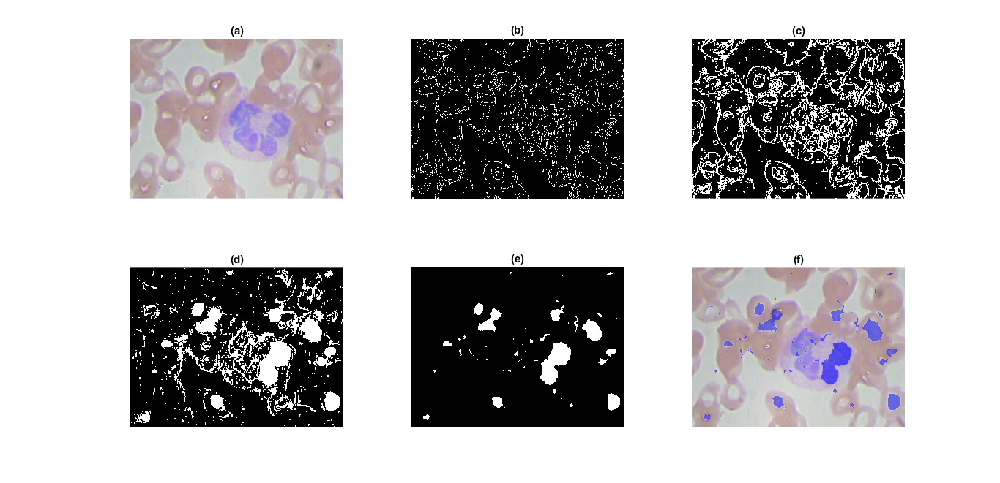

# Segmentation-of-White-Blood-Cells-using-Image-Processing-techniques
Introduction
============

White blood cells (WBC) are important parts of our immune system, they
flow through the bloodstream to fight viruses, bacteria, parasites and
other foreign invaders that threaten our health. They are five types of
WBC, the number of these types and the total number of WBCs provide
important information about our health status. Diseases such as
leukemia, AIDS, autoimmune diseases, immune deficiencies, blood diseases
can be diagnosed based on the number of WBCs.\
The fast evolution of computers, image processing, automatic detection,
classification, and count of white blood cells (WBCs) could be
accomplished using microscopic images of WBCs. This automation is of
great significance to increase efficiency and reduce a doctor's burden,
as traditional manual counting requires a lot of expertise.\
For given microscopic images, the counting work generally includes WBC
segmentation, feature extraction, and classification. Among these, a key
question is how to use performing procedures to segment WBCs, because
effective procedures of segmentation often bring high accuracy of
segmentation, and the accuracy will directly affect the medical
diagnosis and therapy result.\
However, WBC segmentation is challenging and complex work because of the
various shapes and sizes of cells, uneven dying, cell adhesion, and some
external environmental factors, such as illumination and different
microscopic views. Because of this, so far there are no fast and
efficient methods to generate accurate results.\
Though much remains to be done, results from recent studies show promise
toward quicker, more efficient WBC segmentation. Some general
segmentation algorithms used for natural images, such as CNN, edge
detection, automated thresholding, morphology, region growing,
multiscale analysis, and watershed, have been modified and applied for
the segmentation of WBCs [@paper1].\
Blood cells segmentation is a challenging step for many researchers,
each of them has proposed his approach, for example, in [@paper2] they
have proposed using a novel combination of K-Means Clustering and
Modified Watershed Algorithm, to segment nucleus the authors applied
three steps described as preprocessing, K-Means algorithm, and
morphological operations. for cell segmentation, they also proposed
three subparts to extract the WBCs: preprocessing, thresholding, and
morphological operations, then they separate touching nuclei by a
modified watershed transform method, the first step was to detect
overlapping nuclei and then separation of overlapping nuclei.\
The calculated results they could achieve for $T_{s}$, precision, and
sensitivity respectively were 92.07%, 96.07%, and 94.30% for nucleus
segmentation 92.93%, 97.41%, and 93.78% for cell segmentation.\
In other research, they adopted a different approach [@paper3] presented
as six steps for the segmentation method: (1) semantic segmentation of
nuclei and background using CNN; (2) determining connected object on the
semantic map generated by CNN; (3) detection of connected clusters of
objects (clustered nuclei) based on their area and roundness; (4)
applying conditional erosion to determine nuclei seeds among clumped
objects; (5) separation overlapping nuclei using seeded watershed; (6)
aggregating segmentation results for overlapping and non-overlapping
nuclei, the paper shows that CNN is more effective than adaptive
thresholding and Otsu thresholding in detecting overlapping objects, so
it has gained the highest accuracy.

Materials and Methods
=====================

To segment nuclei without consuming a lot of computing power we are
proposing simple steps as follows: Segmentation by color, Morphological
operations, Modified watershed.

Segmentation
============

Segmentation by shape :
-----------------------

We started the segmentation of the blood cell image by the method of
shape detection, which is based on the followig steps :after reading the
image we detect the contour/outline and so the entire cell (Figure 1:
b), and then we dilate the image by the structuring element disk and
fill the interior gaps (Figure 1: c), after that we remove the connected
objects on border and smoothed the object by the structuring element
disk which represents the segmented image (Figure 1: e), and we finish
by visualising the segmentation of the image (Figure 1: f).

The segmentation based on the shape of the Nucleus cell is not reliable,
because, for each image, it is necessary to modify the number of times
of erosion of dilation.

Segmentation by color :
-----------------------

As we realized previously that the segmentation by shape is not an
efficient method for the segmentation and reason that led to that , so
we suggest a different method which is the segmentation by color , and
to use this method to accomplish better results that we pursued the
following steps : as always we start by reading the image of the blood
cell , and then extract the blue plane and apply the binarization ,
after that we remove the small objects from the binary image, and finish
by applying the morphological operations 'closing and opening' and
visualizing the results of the segmentation.

We find the color-based segmentation of the Nucleus cell to be reliable,
and apply to all images without any modification.

### Extracting the blue plane

In order to make the nuclei more evident, we used a simple equation to
extract the blue plane from RGB color space (Figure 2: b), describes as:
$$BPlane = I_{B}  - 0.5*(I_{R}) - 0.5*(I_{G})$$

### Thresholding

The histogram obtained of the blue plane extracted (Figure 2: c) is
composed of two areas the first is greater than 29 represent the
nucleus, the other area is smaller than 29 which represents the rest of
pixel values, we chose as threshold 29 to binarize the grayscale image.

### Remove small objects from binary image

After we binarized the grayscale image, we can now remove all connected
components that have fewer than 1000 pixels from the binary image
(Figure 2: e).

### Morphological operation

We applied the closing operation which is the erosion of the dilation of
a set by the structuring element to remove small holes in the
foreground, changing small islands of background into the foreground.\
Together with the closing, we used the opening operation to remove the
noise, by removing the small objects from the foreground of the image,
and placing them in the background (Figure 2: f).

Splitting of touching nuclei and cells
======================================

Now the nuclei segmentation is done, the second challenge is to separate
the touching nucleus, in this section, we are proposing a modified
watershed algorithm.\
The \"raw\" watershed transform is known for its tendency to
over-segment an image (Figure 3: d). Each local minimum, no matter how
small, becomes a catchment basin. A common trick, then, in
watershed-based segmentation methods is to filter out tiny local minima
and then modify the distance transform so that no minima occur at the
filtered-out locations. This is called **minima imposition** (Figure 3:
e).\
The final step is to modify the distance transform so it only has minima
at the desired locations, and then repeat the watershed steps (Figure 3:
f).

Conclusion
==========

In this paper, we present a model of WBC segmentation, which first
detects and then segments to achieve accurate WBC segmentation. In the
detection stage, we used the method of shape detection to detect the
contour and the entire cell and visualize the segmentation of the image
which was not an efficient method, so we suggest the segmentation by
color to get better results after extracting the blue plane to apply
binarization, removing small objects from the binary image and applying
morphological operations which are closing operation and opening
operation. After the segmentation was done, the last phase was the
splitting of touching nuclei and cells using the modified watershed
algorithm.
